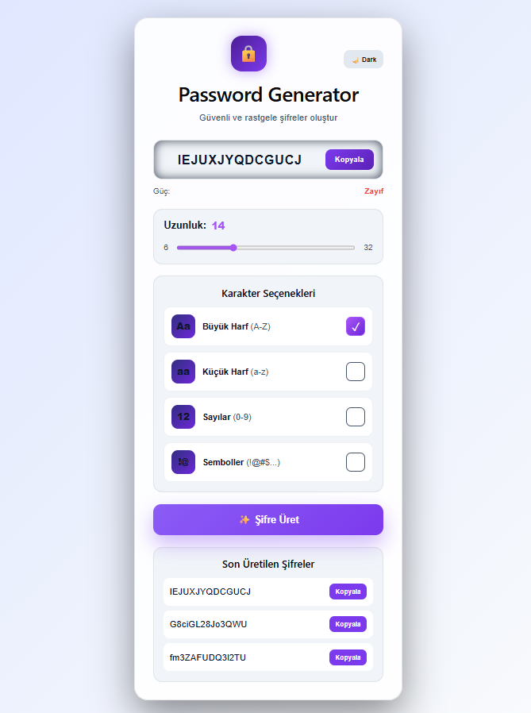

# Password Generator

React ile geliştirilmiş, kullanıcı tercihlerine göre güçlü ve rastgele şifreler oluşturan modern bir web uygulaması.

## Özellikler

* Şifre uzunluğu seçme (6 - 32)
* Büyük harf, küçük harf, sayı ve sembol seçenekleri
* Şifre güç göstergesi (Zayıf / Orta / Güçlü)
* Tek tıkla şifre kopyalama
* Kopyalama sonrası toast bildirimi
* Dark / Light mode desteği
* Son 5 üretilen şifre geçmişi
* Modern ve responsive UI
* React Hooks kullanımı

## Kullanılan Teknolojiler

* React
* Vite
* JavaScript
* CSS

## Kurulum

Projeyi localde çalıştırmak için:

```bash
git clone https://github.com/Aley777/PasswordGenerator.git
cd password-generator
npm install
npm run dev
```

## Ekran Görüntüsü



## Canlı Demo

> (Deploy sonrası buraya Vercel linkini ekle)

## Proje Yapısı

```bash
password-generator/
│── src/
│   ├── App.jsx
│   ├── App.css
│   └── main.jsx
│── public/
│── index.html
│── package.json
```

## Amaç

Bu proje:

* React pratiği yapmak
* UI/UX geliştirmek
* Component yapısını öğrenmek
* Küçük ama etkili bir portfolio projesi oluşturmak

amacıyla geliştirilmiştir.

## Geliştirici

GitHub: https://github.com/Aley777
